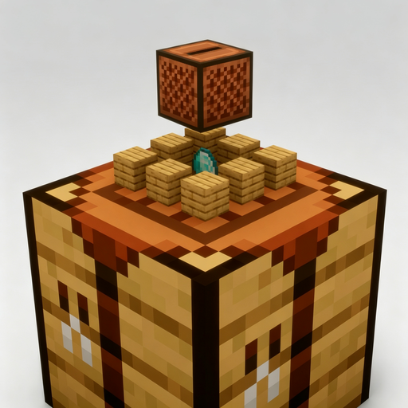

# Real-time CraftingTable

**A real-time 3D preview of your crafting result — materials float above the workbench, and the result hovers and slowly rotates above them, And they all feature smooth animations.**

> A Fabric mod that adds a **real-time 3D preview** to the vanilla Crafting Table. Install on your client and it works — even on vanilla servers. Author: Xliecc　｜　License: MIT

📖 **[中文说明](README_zh.md)**

## ✨ Features
- **Real-time 3D preview** — materials float above their slots; the result hovers and rotates when a recipe matches
- **Keep items after closing** (optional) — use the workbench like a container; state persists and syncs in multiplayer
- **Highly customizable** — floating style, animations, facing, sizes, speeds and more, all via Mod Menu
- **Performance friendly** — idle workbenches cost nothing; render state reused across frames
- **LAN / dedicated server support** — synced between clients when both sides have the mod

## 📦 Dependencies
- [Fabric API](https://modrinth.com/mod/fabric-api)
- Optional: [Mod Menu](https://modrinth.com/mod/modmenu) + [Cloth Config](https://modrinth.com/mod/cloth-config) (config screen; works fine without them)

## ✅ Supported versions
- **Minecraft Java Edition 26.2** (Fabric Loader ≥ 0.19.3, Fabric API ≥ 0.158.0+26.2, Java 25)
- Older Minecraft 1.21.11 builds are maintained on the `1.21.11` branch

## ⚙️ Configuration
- Mod Menu → this mod → config screen; all changes apply immediately
- Or edit `config/real-time-crafting-table.json` directly (auto-generated on first run)
- **⚠️ `keep-items-when-closed` is OFF by default** — enable it to keep materials in the table after closing the GUI. This is the most important setting to know about

## ❓ FAQ
- **Preview not showing?** Make sure the workbench is in view and the mod is installed on your client
- **No config screen with Mod Menu?** You also need [Cloth Config](https://modrinth.com/mod/cloth-config)
- **Items not kept after closing the table?** Make sure you have enabled the "Keep materials when closing the table" option in the config. If two players with different configs open the same crafting table GUI at the same time in multiplayer, the config of whoever closes it last takes effect (the two configs don't interfere with each other)
- **Why doesn't the preview rotate with me when I reopen the GUI?** In multiplayer, the rotation follows the last player who operated the table. It only follows you after you actually interact with the table (e.g., pick up an item from the table and put it back)

## 🙏 Acknowledgements
- **Visual Workbench** ([Modrinth](https://modrinth.com/mod/visual-workbench), MPL-2.0): the idea was inspired by it; the code is an independent rewrite

## 📜 License
[MIT](LICENSE) © 2026 Xliecc
